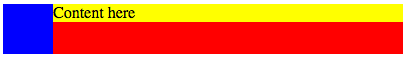

# Lesson 8: Flow and Floats

Identifier   | Objectives
-------------|------------
CSS: 8.1     | Demonstrate Float Syntax
CSS: 8.2     | Explain Float applications
             | &bull; Text Wrapping
             | &bull; Media Object
             | &bull; Columns
CSS: 8.3     | Explain float clearing approaches
             | &bull; Element with inline `clear: left` Approach
             | &bull; CSS Pseudo Element `::after` Approach
             | &bull; Block Formatting Context `overflow: hidden`

## Resources
- __Video__ [Getting along with Floats](https://www.youtube.com/watch?v=4gE1mThzhSw)

## Practice

### Media Object



```html
<div class="container">
	<div class="graphic"></div>
	<div class="content">Content here</div>
</div>
```

```css
.container {
	background-color: red;
	width: 400px;
	overflow: hidden;
}

.container .graphic {
	float: left;
	width: 50px;
	height: 50px;
	background-color: blue;
}

.container .content {
	margin-left: 50px;
	background-color: yellow;
}
```