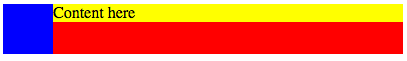

# Lesson 8: Layout with Flexbox

Identifier   | Objectives
-------------|------------
CSS: 8.1     | Explain Flexbox Syntax
CSS: 8.2     | n/a
CSS: 8.3     | n/a
CSS: 8.4     | n/a


## Resources

- [Flexbox: Next Generation CSS Layout has Arrived](http://blog.teamtreehouse.com/flexbox-next-generation-css-layout-arrived)
- [A Guide to Flexbox](https://css-tricks.com/snippets/css/a-guide-to-flexbox/)

## Practice

### Media Object

Study the following media object.



HTML:
```html
<div class="container">
	<div class="graphic"></div>
	<div class="content">Content here</div>
</div>
```

CSS:
```css
.container {
	background-color: red;
	width: 400px;
	display: flex;
}

.container .graphic {
	width: 50px;
	height: 50px;
	background-color: blue;
}

.container .content {
	flex: 1;
	background-color: yellow;
}
```

### Homework

Build the following page using the media object pattern:


The solution is provided in HTML and CSS files.
