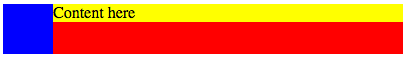
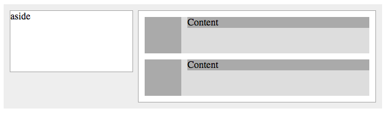

# Lesson 9: Layout with Floats

Identifier   | Objectives
-------------|------------
CSS: 9.1     | Demonstrate Float Syntax
CSS: 9.2     | Explain Float applications
             | &bull; Text Wrapping
             | &bull; Media Object
             | &bull; Columns
CSS: 9.3     | Explain float clearing approaches
             | &bull; Element with inline `clear: left` Approach
             | &bull; CSS Pseudo Element `::after` Approach
             | &bull; Block Formatting Context `overflow: hidden`

## Resources
- __Video__ [Getting along with Floats](https://www.youtube.com/watch?v=4gE1mThzhSw)

## Presentation

- [View Presentation](https://docs.google.com/presentation/d/1GfJshIdk7usiEw0dP9wELhAEHPbgbzqkGcRbgTAmf_k/edit#slide=id.p)

## Practice

### Media Object

Study the following media object.



HTML:
```html
<div class="container">
	<div class="graphic"></div>
	<div class="content">Content here</div>
</div>
```

CSS:
```css
.container {
	background-color: red;
	width: 400px;
	overflow: hidden;
}

/* another way to do this is to not use `overflow: hidden;` and include the pseudo `::after` as follows.

.container::after {
	content: '';
	display: block;
	clear: both;
}

*/

.container .graphic {
	float: left;
	width: 50px;
	height: 50px;
	background-color: blue;
}

.container .content {
	margin-left: 50px;
	background-color: yellow;
}
```

### Homework

Build the following page using the media object pattern:



The solution is provided in HTML and CSS files.
