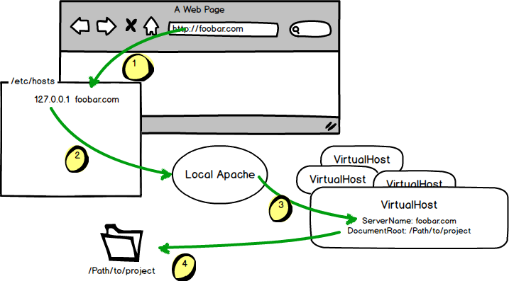

# Computer Setup

## OS

Students should have a recent version of Ubuntu (or similar Linux OS like Mint) or OS X. These instructions will serve as a guide and checklist of the tasks that need to be complete

### Ubuntu

- Install Ubuntu
- [Install LAMP](Ubuntu-14.04 LAMP.md)

### OS X
- [Install MySQL](OS X Install MySQL.md)
- [Install Homebrew](http://brew.sh/)

## Apache and Virtual Host Setup

You'll need to know basic Unix commands for these steps. Here is a little legend of common commands you'll need:

- `whoami`: See what your username is
- `pwd`: "Print Working Directory" - see what folder you're in
- `sudo`: Type this before other commands to have a higher level of permissions
- `sudo apachectl restart`: Restart Apache
- `ls`: List the files of the current directory
- `ls -la`: List the files of the current directory including hidden files

Setup Apache and Virtual Hosts for your computer

- [OS X Yosemite](https://gist.github.com/bradwestfall/c3e44d5c1e4a74ad852e)
- [OS X Mavericks](https://gist.github.com/bradwestfall/df915300c0d5022e5cb2)
- [Ubuntu 14.04](Ubuntu-14.04 Apache and VHosts.md)

## localhost

Create a VirtualHost called "localhost"

```sh
<VirtualHost *:80>
    DocumentRoot "/Users/[username]/Sites/localhost"
    ServerName "localhost"
</VirtualHost>
```

Restart Apache

```sh
sudo apachectl restart
```

Create the PHP file `index.php` at `~/Sites/localhost/php/index.php` with the following contents:

```php
<?php
phpinfo();
?>
```

Visit "localhost/php" in the browser. See if PHP pulls up the info page.

> Note that for localhost, we do not need to add a record in our hosts file at `/etc/hosts` because Apache will already have a record there for us.

## Additional VirtualHosts

Create more Virtual Hosts for all your Milestones. Below is the an example of what your M1 VirtualHost should have:

A Virtual Host file at `~/[username]/Hosts` named "m1.conf":

```sh
<VirtualHost *:80>
    DocumentRoot "/Users/[username]/Sites/m1"
    ServerName "dev.m1.com"
</VirtualHost>
```

Restart Apache

```sh
sudo apachectl restart
```

Add a record in your "hosts" file at "/etc/hosts":

```sh
127.0.0.1   dev.m1.com
```

