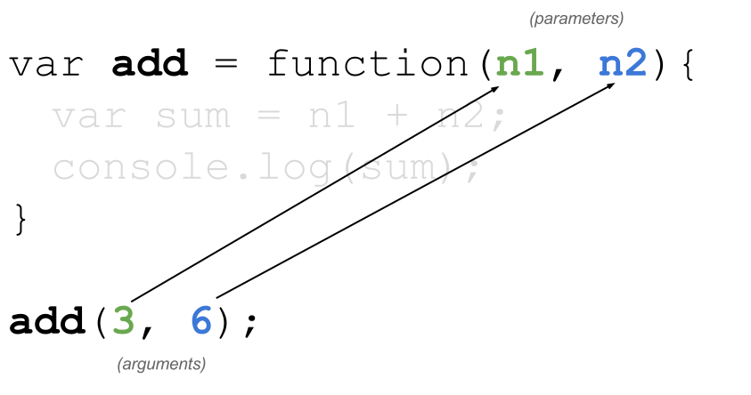
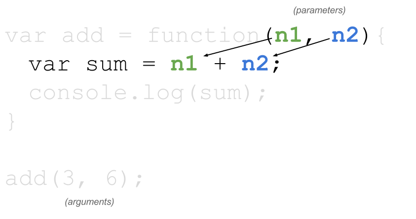
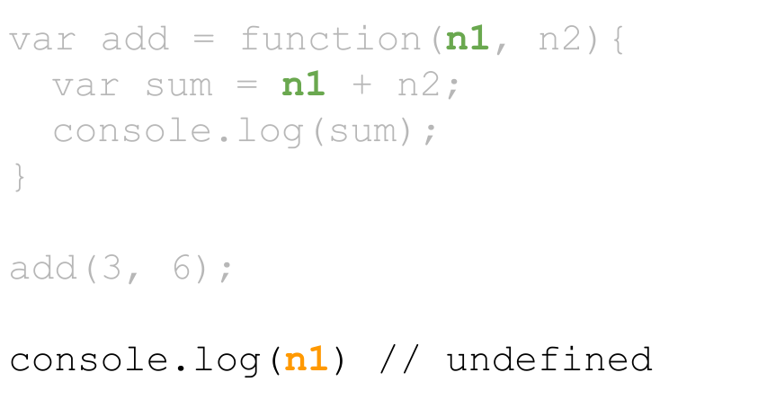

# Lesson 4: User Defined Functions

Identifier   | Objectives
-------------|------------
JS: 4.1      | Explain the purpose of making your own functions:
             | &bull; Code reuse
             | &bull; Abstraction of ideas
             | &bull; Making shorter chunks of code
JS: 4.2      | Demonstrate proper function creation syntax
             | &bull; `function foo() {}` Function Declaration
             | &bull; `var foo = function() {}` Function Expression
JS: 4.3      | Explain and demonstrate the return statement
             | &bull; If nothing is returned, then "undefined" will be returned
JS: 4.4      | Explain function "hoisting"

## Resources

- [Functions][functions]
- [Lexical Scope and Hoisting][scope]
- [Lexical Scope vs. Dynamic Scope][lexicaldynamic]

## Pre Study

Every function in JavaScript is a [Function object][functionobj]. JavaScript has two fundamental ways to create functions: "Function Declarations" and "Function Expressions".

```js
// Function Declaration
function foo() {
  // code goes here
}

// Function Expression
var foo = function() {
  // code goes here
}
```

The two ways of writing functions are not interchangeable though. While they work the same in a lot of ways, the high level differences are as follows:

- Function declarations are *hoisted* to the top of their scope
- Function expressions hoist their name to the top of the scope, but not their assignment

### How functions work

Functions are a way for us to bundle reusable logic together. One analogy is thinking of functions like a recipe. Consider this code:

```js
var add = function (n1, n2) {
  console.log(n1 + n2);
};
```

This is a "recipe" for adding two numbers together. One very important thing to know is that functions **won't** be executed until they are called. Sort of like how a recipe is just a set of instructions that sits in a book. The recipe needs to be acted upon in order to be realized.

To call a function, you "reference" it's name plus parenthesis `()`:

```js
add();
```

When calling functions you can also pass *arguments* into the function. When we pass these values in, separated by comma, these values get assigned to the `n1` and `n2` variables, called parameters.

- **Arguments** are values passed into a function
- **Parameters** are named indexes on the function signature

A parameter refers to an argument that was passed in, in a specific order. In the `add` function, `n1` is a **parameter** that refers to the *first argument* the function received.

There are a few key points to know here:

1. The parameters `n1` and `n2` are variables that get created each time the function is called. In other words, the first time we call the function, the interpreter will assign `n1 = 3` and `n2 = 6`. How does the function know which argument value to assign to which parameter? It's all based on the order that the arguments are stated. The first argument gets assigned to the first parameter etc...

  

1. Second: When a function is called, it's parameters become variables for use inside the function. We don't need to declare these variables this way: `var n1 = 3` because the fact that it is a parameter and we passed in an argument does that for us.

  

3. Variables created within functions, such as `n1` and `n2` in this case, are not available on the outside of the function. Let's imagine we tried to `console.log` the `n1` variable that was created within the function later on. The `n1` variable from in the function isn't accessible from the outside. Thus we would get `undefined`:



Let's do something slightly different now:

```js
var add = function(n1, n2) {
  console.log(x); // undefined
  console.log(n1 + n2); // outputs 9
};

var x = 3;
var y = 6;

add(x, y);
```

Notice in this case we're passing in variables as arguments instead of literal values. A very important detail is that we're not actually passing the variables `x` and `y` in the function. Instead we're passing the values of `x` and `y`. Writing the code this way is exactly the same as what we had before by calling `add(3, 6)`. But it's very important for beginners to know that the variables `x` and `y` are only available on the outside of the function, where they were declared, and the variables `n1` and `n2` are only available on the inside of the function, where they were declared. The way this code is written, we're assigning the value of `x` which is `3` to `n1`, then the value of `y` which is `6` to `n2`. The variable names **do not have to match.**

### Scope

As stated before, variables created within a function's scope are not available in their parent scope (In this case the parent scope is the global scope).

In the code below, we've called the function `foo` which declares a variable `x` inside itself. So the `x` variable cannot be used from the global scope as this example shows:

```js
var foo = function() {
  var x = 7;
};

foo();
console.log(x); // causes an error, x is undefined.
```

[Run Code](http://jsbin.com/hexinajuha/edit)

However the opposite is true of variables created in the parent scope:

```js
var x = 3;

var foo = function() {
  console.log(x); // outputs 3
};

foo();
```

This is a subject called [Lexical Scope][scope] which for JavaScript means that a function will have access to variables from outside the function (in certain cases)

Let's test your knowledge further. What do you think the next code will output?

```js
var x = 4;

var foo = function(x) {
  console.log(x);
};

foo(5);
```

The output will be `5`. While functions have lexical scope and "can" access variables from outside the function - in this case we're passing in an argument `5` into the function which gets assigned to the parameter `x`. If a function has to choose between using it's internal variables vs the ones from the outside, it will choose the internal ones.


### Return

So far we've been creating output within the functions. This is okay for demonstrating how functions work to beginners, but generally speaking, functions should return values. Let's rewrite the `add` function to return the value instead of outputting one:

```js
var add = function(n1, n2) {
  var sum = n1 + n2;
  return sum;
}

add(3, 6); // outputs nothing
console.log( add(3, 6) ); // outputs 9
console.log( sum ); // undefined
```

This time the function is returning a value. Notice I said value? The `sum` variable has scope which is restricted to inside the function where it was declared. But we can return it's value to the caller. Then notice that the caller can do something with the value, like console logging it. Let's rewrite the function another way:

```js
var add = function(n1, n2) {
  sum = n1 + n2;
  return sum;
}

var answer = add(3, 6);
```

Now notice that we are taking the value returned from the function and assigning it to a variable. Again it's important to know that `sum` and `answer` are in different scopes and while we returned the `sum` value and assigned it to the `answer`, they are completely separate variables.

So far we have written functions are called them but in most cases functions are "black boxes". In other words we know how to call them and pass stuff in, but for the most part we don't know or care about what happens inside the function as long as we get what we expected in return. So we wouldn't want the internal creation of variables like `sum` to have an effect in the caller's scope.

#### Default Return

In JavaScript, functions will return `undefined` if no specific return value is specified:

```js
var add = function(n1, n2) {
  var sum = n1 + n2;
  return sum;
}

var subtract = function(n1, n2) {
  var sum = n1 - n2;
}

console.log( add(1, 2) ); // Outputs 3
console.log( subtract(1, 2) ); // Outputs undefined
```

Even though the `subtract` function doesn't return anything, it still made it's internal `sum` variable. It just didn't return it so the caller gets `undefined` returned to it.


#### Accepting the return

Sometimes functions return things and sometimes they don't. When they don't return things such as:

```js
someFunction();
```

Then we can call the function as this code shows without a worry of what it returns. However if a function does return something:

```js
var a = someFunctionWithAReturn();
```

Then we need to "catch" or "accept" the returned value in some way. The code above accepts it by assigning it to the `a` variable. Or we could do this:

```js
console.log(someFunctionWithAReturn());
```

Now we're calling `console.log()` which wants a value passed in and we're passing the value that gets returned from `someFunctionWithAReturn()`;


### Caller on hold

Another very important thing to know about functions is how the caller must wait for the function to return before the caller can continue. For this example, what is the order that we'll letters "a", "b", and "c" will be outputted?

```js
var foo = function() {
  console.log('a');
}

console.log('b');
foo();
console.log('c');
```

Keep in mind that even though the function expression is first and has a `console.log()` inside it, the function does not execute until it's called. Think of it like a recipe that's on a shelf waiting to be cooked.

The example above will produce "bac" for our output.

The first line if code to create output is `console.log('b')`. Then the function `foo()` is called and the place where `foo()` is called from goes on hold until the function is done. Inside the function we do `console.log('a')`. Then the function returns to the caller. Then the code can do `console.log('c')`

Remember, even though the function doesn't have a `return` word in it, the function returns by default when the closing curly brace `}` happens.


### Nested Function Calls

When a function returns a value, like in the case of the `add()` function, the function call can be treated just like a value:

```js
var answer = add(3, 4);
```

The `answer` variable gets its value from the function just as if we had assigned a normal value:

```js
var answer = 7;
```

This is important to understand when we're nesting function calls. Let's assume we have two functions `add` and `divide`:

```js
var add = function(n1, n2) {
    return n1 + n2;
};

var divide = function(n1, n2) {
    return n1 / n2;
};

var answer = divide(10, 2); // answer is now 2
var sum = add(answer, 3); // sum is 8
```

This is good but it requires us to make an `answer` variable that we might not need. Let's condense the code to use less lines:

```js
var add = function(n1, n2) {
    return n1 + n2;
};

var divide = function(n1, n2) {
    return n1 / n2;
};

var sum = add( divide(10, 2), 3 ); // sum is 8
```

This time we still get `sum` to be `8` but we didn't have to use two lines of code to do it. We were able to call `divide(10, 2)` and get the return value (which is 5) and immediately pass that into the first argument of the `add()` function. Doing so has the same effect as if we had done:

```js
var sum = add( 5, 3 ); // sum is 8
```

Using the return value from one function and immediately passing it in as an argument to another function call is actually quite common in programming.

## Practice

Write functions that perform the following tasks:

- Write a function that adds three numbers
- Write a function that adds four numbers
- Write a function that concatenates a first and last name

## Practice Solutions

Write a function that adds three numbers:

```js
var addThree = function(a, b, c) {
  return a + b + c;
}
```

Write a function that adds four numbers:

```js
var addFour = function(a, b, c, d) {
  return a + b + c + d;
}
```

Write a function that concatenates a first and last name

```js
var fullName = function(first, last) {
  return first + ' ' + last;
}
```

## Exercises

- [The Dairy Farm Exercise: 45+ minutes meant to be done in class and ran by an instructor](dairy-farm.md)

[functions]: https://developer.mozilla.org/en-US/docs/Web/JavaScript/Reference/Functions
[scope]: http://www.adequatelygood.com/JavaScript-Scoping-and-Hoisting.html
[functionobj]: https://developer.mozilla.org/en-US/docs/Web/JavaScript/Reference/Global_Objects/Function
[lexicaldynamic]: https://en.wikipedia.org/wiki/Scope_(computer_science)#Lexical_scope_vs._dynamic_scope
