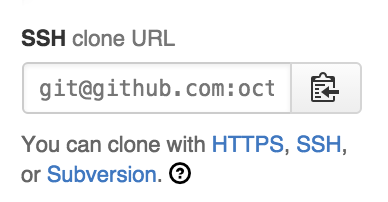
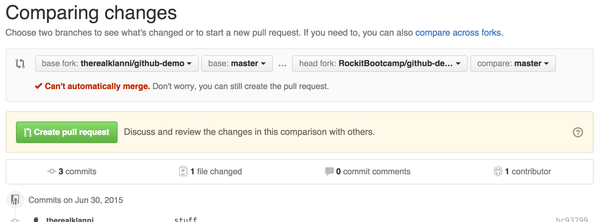
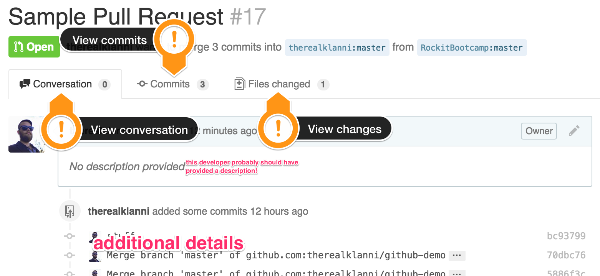
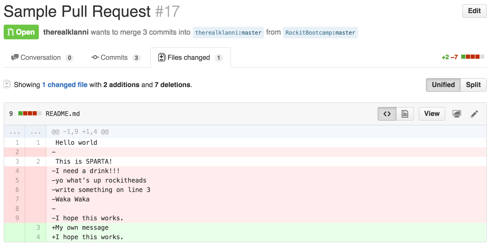

# Lesson 2: GitHub and Collaboration

Identifier   | Objectives
-------------|------------
Git: 2.1     | Demonstrate creating a repo at GitHub and cloning the repository to the local machine
Git: 2.2     | Demonstrate setting up remotes at GitHub
Git: 2.3     | Demonstrate resolution of merge conflicts
Git: 2.4     | Demonstrate forking repositories on GitHub
Git: 2.5     | Demonstrate creating pull-requests on GitHub
Git: 2.6     | Demonstrate merging pull-requests on GitHub

## Resources

- [Guide to Forking](https://guides.github.com/activities/forking/index.html)

## Pre Work

Before collaborating on GitHub, it's best to generate an SSH key and add it to your account before getting started. This makes everything easier by removing the necessity for entering your username and password for every `git push` or `git pull` command.

### Generate an SSH identity

Before generating SSH keys, check to see if you already have done so.

```sh
ls ~/.ssh
```

This should output a list including 2 important files: `id_rsa` and `id_rsa.pub`.

> The `id_rsa` file is your **private key**, do not ever let this file come into someone else's possession or any system that uses it will be compromised, including but not necessarily limited to GitHub.

If you see these files already, it's a good idea to *use the ones you already have*, unless any of the following conditions are true:

- You suspect the private key may have been compromised
- A passphrase was created on the keys and you have forgotten it
- You are willing to accept the consequences that overwriting it may make any other system that depends on it become inaccessible to you

When in doubt, keep your existing keys, or at least back up the existing ones before proceeding.

Once you are sure you want to proceed, enter the following command in your terminal:

```sh
ssh-keygen
```

You will be asked a series of questions. It's recommended you just press `enter` at each prompt to accept the default file location and forgo a passphrase.

You should see output similar to the following:

```
Generating public/private rsa key pair.
Enter file in which to save the key (/home/demo/.ssh/id_rsa):
Enter passphrase (empty for no passphrase):
Enter same passphrase again:
Your identification has been saved in /home/demo/.ssh/id_rsa.
Your public key has been saved in /home/demo/.ssh/id_rsa.pub.
The key fingerprint is:
4a:dd:0a:c6:35:4e:3f:ed:27:38:8c:74:44:4d:93:67 demo@a
The key's randomart image is:
+--[ RSA 2048]----+
|          .oo.   |
|         .  o.E  |
|        + .  o   |
|     . = = .     |
|      = S = .    |
|     o + = +     |
|      . o + o .  |
|           . o   |
|                 |
+-----------------+
```

### Adding your public key to GitHub

Now that you have SSH keys, you can add your **public key** to GitHub. Make *certain* you follow these instructions very carefully so you don't inadvertently add your *private key* to GitHub—that would be bad.

First, go to your [SSH Keys](https://github.com/settings/ssh) settings page in your profile (just open the link in a new tab).

Then you will need to click the "Add SSH key" button at the top of this page. It should open a form at the bottom of the page.

Enter a "title" in the form. Typically this should be the name of the computer the SSH key was generated on.

Next, from terminal, use the following command to get your **public** key and copy it to the clipboard.

```sh
cat ~/.ssh/id_rsa.pub
```

Your public key should look something like this:

```
ssh-rsa AAAAB3NzaC1yc2EAAAADAQABAAABAQCfOpIf9Ne2eWwT3YxzglWWIEHLb0xDnsIUlUDs+n98Rh1eSBjEUmQ0SSSnHkQRw0qiCTLWXidb6S78mKWarXXoH9oXq7jEHs4dTgJn48WTpnQ6aG+zKt/mhGmcomK2YKpf/A4CeehGj8kNzTSV9VgDQ9hvlPg8AiKrPD0n/kKL869rmr2bM+Xg1CG/rhfQ9a9nsG2lbmH0cgC4wOBXw86QN7b5MlHLTwhiA8uQGBAWuZ+vrw5X7R4NjjzAqAvVme0gd07roYz6vhNV7yNp5zg5Orx89uCMIJAo/hN0FMBKT5hcL47zkOjfhaMLV7dGKcwSWriYoLGXptCpKCOzHiLH therealklanni
```

> Yep, that's an actual public key. It's called that because it's considered public information. You can give it out freely with no risk.

Copy and paste it into the "Key" text area on the form and then click the "Add key" button to complete the process.

## Pre Study

Working on projects on GitHub follows a basic workflow. Projects are created by the original content author, other developers can fork these projects, then they can create a pull-request back to the original project with their own changes, then the original author can choose to merge the pull-request. Below is a diagram showing the basic process.


At the top left is the original project. When a project is forked by another user, a copy of it is made in their own account. After making some changes they can request a pull (merge) of their change to the original project.

### Creating a new project on GitHub

To start a new project on GitHub, you must first create a new repository by clicking the `+` symbol at the top of the page.


You'll be asked to give the repository a name. Common practice is to use only lower-case letters and dashes between words, e.g. `my-awesome-thing`.

### Cloning a project

Any project can be cloned, but if you intend on contributing to the project (i.e. you don't own the repository) then you should first *fork* it. If you own the repository, clone away!

To clone a repository from GitHub, first visit the project page, e.g. https://github.com/octocat/Spoon-Knife. Then find the *clone URL* on the right side of the page.



If the repository belongs to you, you should **always** use the SSH clone URL. Otherwise, you will need to use the HTTPS clone URL. Use the links provided to switch between them.

Once you have the clone URL, go to your terminal and `cd` to the directory where you keep your projects. Then use the following command to clone your repository.

```sh
git clone git@github.com:YOURUSERNAME/REPOSITORY-NAME.git
```

If you did it correctly, you should now have a new subdirectory having the same name as the repository name.

### Forking a repository on GitHub

"Forking" is a term specific to GitHub (though other hosted Git platforms like BitBucket have also adopted the terminology). It's the process of creating a copy of someone's project (repository) within the GitHub platform.

To fork a project on GitHub, visit that project's page and look for the fork button near the top right.


Clicking this will copy the repository to your personal account. If the original repository was https://github.com/therealklanni/github-demo the copy will be created as https://github.com/YOURUSERNAME/github-demo

### Creating pull-requests

A "pull request" (also known as "PR") is another concept invented by GitHub. It's simply the process of notifying the owner of the original project that you would like them to merge your own changes "upstream" to the original repository.

The best practice with pull-requests is that they should only contain one contingent set of changes, not an array of changes that are not related to each other.

To create a pull-request, first you need to have created and pushed some commits to your own fork. If you've done this already, you can start the pull-request process by first visiting your fork's page on GitHub, e.g. https://github.com/YOURUSERNAME/github-demo

Then go to the "Pull requests" view (link on the right side of the page) and click the "New pull request" button near the top-right of the page.


You should see something like the screenshot below.



If you don't see "base fork: ..." on the left and "head fork: ..." on the right, click the "compare across forks" link above and set the left (base fork) to the original repository, and the right (head fork) to your repository.

> If you see "Can't automatically merge" here, you may need to pull the changes from the original repository to make it possible for an automatic merge

Click the "Create pull request" button when you're sure everything looks right. Give your pull-request a clear and concise summary of the changes you intend to merge for the "Title" (try to limit this to 50 characters or so) and a more in-depth description of everything that was changed in the comment section. The more descriptive you are, the easier it will be for the owner to decide if your code should be merged with theirs.

When ready, click "Create pull request" again to complete the process. The onus is now on the owner to accept or reject your request. Often times they will not reject it outright, but may make some comments asking for revisions to your code to be made before accepting the request.

> Note that your code is not merged with the owner's until the owner completes the process on their end. If you push more commits to your fork they **will** appear in the pull-request automatically.

### Merging pull requests on GitHub

As the owner of a project, you may occasionally receive pull requests from other developers. This is your opportunity to review the code being offered for style consistency and whether the changes benefit the project. Don't by shy about asking the requester to make some updates to their code before accepting the pull-request. Be amicable and tactful, but straight-forward. Look at the changes, line by line, to ensure the code is good and make comments where necessary. You can also clone their fork to your computer and test their changes to make sure everything works as expected before merging their pull-request, if you like.

To find open pull-requests visit your project page and go to the "Pull requests" view (link on the righthand side of the page). If there are any open pull-requests, they will be listed here. Click the title of one to see the details.

On the pull-request details view, you can view the discussion (read the description and any comments that have been created), see all of the related commits, and view the files that were changed.





When you're ready to merge and GitHub is able to perform an automatic merge, simply click on the "Merge pull request" button for that pull-request, then click "Confirm".

## Exercises

- Fork the [github-demo](https://github.com/therealklanni/github-demo) repository on GitHub
- Clone your new copy of github-demo to your local computer
- Modify the `README.md` file
- Using `git add` and `git commit` commit your changes locally
- Push your changes to your fork of github-demo using `git push`
- Create a pull-request to the original project (note that this is public, so please be mindful of what you write)
