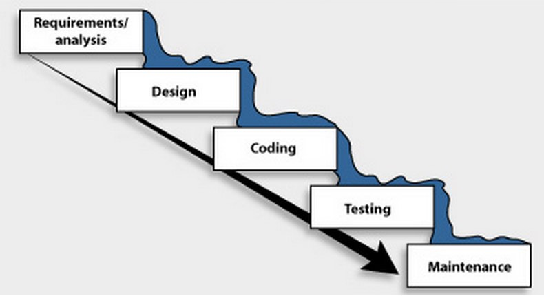
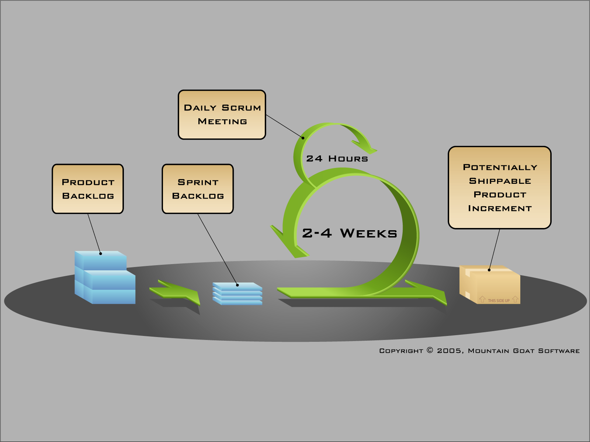

# SDLC

Objectives

- Define Software Development LifeCycle
- Explain Agile
- Explain Scrum
- Explain Kanban
- Explain Common SDLC tasks (Discovery, Development, Testing, Deployment, Maintenance)

# SDLC Overview
There are different models used to develop software. The common steps in each model are:

- Discovery
- Developemnt
- Testing
- Deploying
- Maintenance

## Discovery
The point of the Discovery phase is to **Decide what will be done**
This is similar to the [*Define the Problem*](https://github.com/RockitBootcamp/Student-Resources/tree/master/PDD/PresentingSolution#define-the-problem) in Presenting an idea or solution.

Consider:
- Gather Requirements
- Top-down/bottom-up decomposition
- Prototyping (as needed)
- Estimation & Planning
- Feasibility

## Development
Code to the requirements and include Unit Test
- Coordinate all hardware, software, & IT resources
- Initial Version, just roll it out
- Upgrades require more diligence 

## Testing
Ideally a different team will test your code according to the requirements. They can use different testing methods:
- Functional Testing
- Integration Testing
- Black Box / White Box testing
- Automated Test Scripts
- Stress Testing
- Regression Testing
- User Acceptance Testing

## Deployment
Once testing has been completed, the code is deployed into the production environment.
- Deployment Windows
- Zero Down Time
- Rolling Deployments

## Maintenance
Another team may be responsible to maintain your code. You should consider:
- Knowledge Base Articles (KBA)
- Escalation Plans
- Application Log Tracking
- Server Monitoring
- Site Monitoring
- Failure Reporting
- Tech Writer
- Training Dept

# Waterfall

- Comes from other engineering practices
- *Heavy* up front design
- Necessary for very critical systems
- Lessons from later stages can’t be realized until the next version
- Inflexible in light of changes
- Customer is left out of the process once the first stage is completed
- Is cyclical, but only in terms of versions

# Agile
Is not a methodology, it's a way of thinking
- individuals and interactions over process and tools
- working software over comprehensive documentation
- customer collaboration over contract negotiation
- responding to change over following a plan

# Scrum

Is a methodology which is agile

Key Terms
- Backlog Item 
	- Acceptance Criteria
	- Size
	- Tasks
- Backlog
	- TODO
	- Doing
	- In QA
	- Done vs Done/Done
- Sprint
- Roles
	- Scrum Master
	- Chicken / Pig
	- Product Owner
	- Architect
	- Developer
	- Manager
- Meetings
	- Sprint Planning
	- Daily Stand up
	- Retrospective

## Daily Standup
- What did you work on yesterday
- What will you work on today
- Do you have any roadblocks

## Sprint Planning
- Clarify Acceptance Requirements
- Size backlog items
- Add backlog items to the sprint
- Breakdown tasks

# Activty
Role play a Daily Standup

# Resources
* [Agile Manefesto](http://www.agilemanifesto.org/)
* [Scrum FAQ](http://www.mountaingoatsoftware.com/agile/scrum)
* [Kanban Explained](http://kanbanblog.com/explained/)
* [Difference](http://www.hackerchick.com/2012/01/agile-vs-lean-yeah-yeah-whats-the-difference.html)
