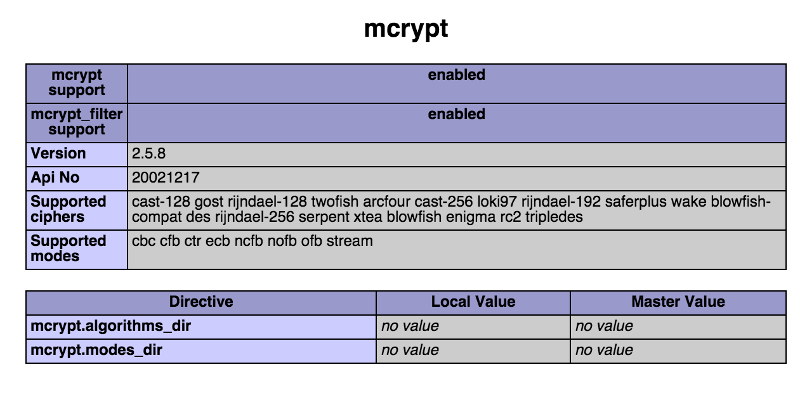

# Gettings Started with Laravel

Install Composer

```ruby
$ curl -sS https://getcomposer.org/installer | php
# move this to your bin folder
$ mv composer.phar /usr/local/bin/composer
```

Install Laravel

```ruby
# Download 
$ composer global require "laravel/installer=~1.1"

# Add Laravel to your paths
$ vi ~/.bash_profile // or nano .bash_profile
export PATH="~/.composer/vendor/bin:$PATH"

# Reload bash file
$ . .bash_profile

# Check to see if it was successful
$ laravel

# this will show usage, options, available commands, etc. if it was successful
```

Create new project
```ruby
$ cd ~/Sites/
$ laravel new myProject


# change directory into the new project then give the following command, which will give you a 
# server to navigate to for the project. For example http://localhost:8000 
$ php artisan serve
```

# Problems
mcrypt

## Use Brew
This method will use the brew version of php. 

### Point apache to homebrew php

Download php with the apache flag to ensure the module is included
```ruby
$brew uninstall php55
$brew install php55 --with-fpm --with-apache

```
Check what module is loaded
```ruby
brew info php55

# Read comment
# To enable PHP in Apache add the following to httpd.conf and restart Apache:
#     LoadModule php5_module    /usr/local/opt/php55/libexec/apache2/libphp5.so
```
Point apache to brew version.

```ruby
vi /etc/apache2/httpd.conf

# Look for section loading php5_module and change to :

LoadModule php5_module    /usr/local/opt/php55/libexec/apache2/libphp5.so
```

Install mcrypt
```ruby
brew install mcrypt
brew install php55-mcrypt
```
Check your info.php to see that mcrypt is installed



# Tips

### Verify Apach Config
Check if Apache Config is correct
```ruby
apachectl configtest
```

### Know what PHP version you have.
The command line and Apache could be pointing to two different version.

### Command Line
```ruby
which php

# List all configuration information
php -i


```
### Check apache version
```ruby
vi /etc/apache2/httpd.conf

; LoadModule php5_module /path/to/php
```


# Brig's setup
Apple OSX 10.10.1
```ruby
$ which php
/usr/local/bin/php

$ ll /usr/local/bin/php
/usr/local/bin/php -> ../Cellar/php55/5.5.22/bin/php

$ php --ini
Configuration File (php.ini) Path: /usr/local/etc/php/5.5
Loaded Configuration File:         /usr/local/etc/php/5.5/php.ini
Scan for additional .ini files in: /usr/local/etc/php/5.5/conf.d
Additional .ini files parsed:      /usr/local/etc/php/5.5/conf.d/ext-mcrypt.ini

$ cat /etc/apache2/httpd.conf | grep php5_module
LoadModule php5_module    /usr/local/opt/php55/libexec/apache2/libphp5.so
```


# references
- http://laravel.com/docs/4.2/quick
- http://coolestguidesontheplanet.com/install-mcrypt-php-mac-osx-10-10-yosemite-development-server/
- [Mcrypt PHP extension required - Mac OS X Yosemite](http://laravel.io/forum/10-06-2014-mcrypt-php-extension-required-mac-os-x-yosemite)
- [How to fix Mcrypt PHP extension](http://digitizor.com/2014/06/29/fix-mcrypt-php-extension-required-laravel/)
- [How to use the PHP brew installed](http://stackoverflow.com/questions/20523183/how-to-use-the-php-that-brew-installed)
- [Brew Install php-fpm and apache2 at same time](https://github.com/Homebrew/homebrew-php/pull/1060)
- [Manual build of mcrypt](http://coolestguidesontheplanet.com/install-mcrypt-php-mac-osx-10-10-yosemite-development-server/)
